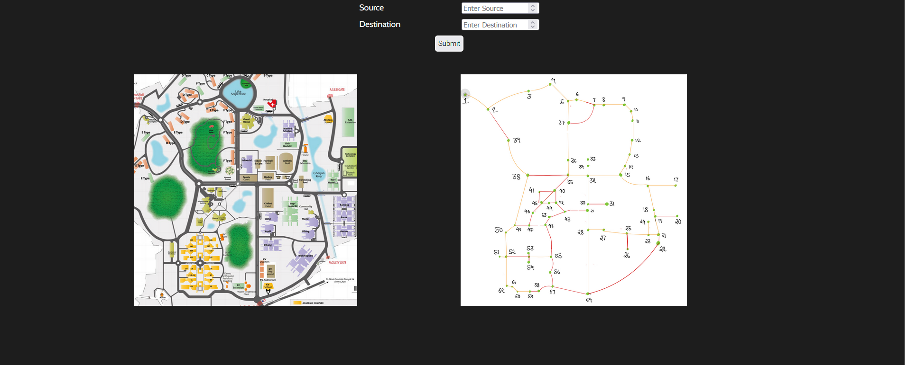

# Shortest Path Finder – IIT Guwahati Campus Navigation

## Overview

Shortest Path Finder is a full-stack web application developed to help users identify the optimal route between different locations on the IIT Guwahati campus. The system models campus locations as graph nodes and computes the shortest path and distance between a selected source and destination.

---

## Project Screenshot



---

## Features

- Interactive IIT Guwahati campus map
- Source and destination selection
- Shortest path computation using graph-based algorithms
- Route visualization
- Distance estimation between locations
- User-friendly web interface

---

## Tech Stack

### Frontend
- React.js
- JavaScript
- HTML5
- CSS3

### Backend
- Python
- Flask
- Flask-CORS

### Development Tools
- Git
- GitHub
- Visual Studio Code

### Concepts Used
- Graph Data Structure
- Shortest Path Computation
- Route Visualization

---

## How It Works

1. Select a source location.
2. Select a destination location.
3. Submit the request.
4. The Flask backend computes the optimal route.
5. The shortest path and total distance are displayed.

---

## API Reference

### Get Shortest Path

```http
GET /shortd/<source>/<destination>
```

| Parameter | Type | Description |
|-----------|------|-------------|
| source | Integer | Source node ID |
| destination | Integer | Destination node ID |

---

## Installation

### Frontend

```bash
npm install
npm start
```

### Backend

```bash
pip install flask flask-cors
python server.py
```

---

## Applications

- Campus navigation
- Route optimization
- Graph algorithm visualization
- Educational demonstration of shortest path algorithms

---

## Future Enhancements

- Real-time navigation
- Mobile-responsive interface
- Travel time estimation
- Additional campus landmarks

---

## Author

**Alok Raj**

